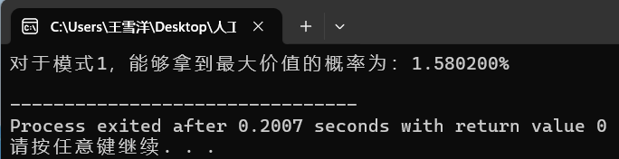

# <center>lab02-战胜选择恐惧实验报告 
<center>学号：21130041034&emsp;&emsp;姓名：王雪洋</center>

## 1.正确的描述出求解概率曲线的代码思想
### （1）模式1：拿走任意一个纸杯下的奖品
&emsp;&emsp;思路：进行10000次模拟，统计每次模拟生成的100个数字里的最大值及其出现次数。对于每次模拟，从100个数字里任取1个数字是最大值的概率为“最大值重复次数/100”。对于10000次模拟产生的10000个概率取平均值，即为模式1取到最大值的概率。考虑到多个浮点数求和再求平均值误差较大，因此我先用sum存储10000次模拟中最大值的重复次数之和，最后除以100*10000即为所求。\
&emsp;&emsp;C语言代码：
```C
double sum=0;//方案1：对于10000次模拟，计算随机取1个即为最大价值的概率
for(int i=0;i<10000;i++){//模拟10000次
    int max_value_cnt=0,max_value=0;//记录每次模拟的最大价值及重复次数 
    int uniform_int_random_1_100[100]={0};//用于存储每次模拟生成的100个随机数
    for(int j=0;j<100;j++){//每次生成100个随机数 
        uniform_int_random_1_100[j] = 1 + rand() % 100;
        if(uniform_int_random_1_100[j]>max_value){//更新max_value并记录重复次数 
            max_value=uniform_int_random_1_100[j];
            max_value_cnt=1;
        }else if(uniform_int_random_1_100[j]==max_value){
            max_value_cnt++;
        }
    }
    sum += max_value_cnt;
}

//求取到最大价值的概率
double ret1=0;
ret1 = sum/(100*10000);ret1 *= 100;
printf("对于模式1，能够拿到最大价值的概率为：%f%%\n",ret1);
```

### （2）模式2：苏格拉底麦穗问题
&emsp;&emsp;思路：进行10000次模拟。对于每次模拟产生的100个数字，记录最大值为max_value，然后从k=1到k=99遍历，每次遍历统计前k个数字的最大值记为v，从k+1个数字开始，根据v找到后来第一个大于v的数字，如果找到了而且这个数字等于max_value，则说明成功取到最大值，该k的成功次数加1。10000次模拟之后，统计得出成功次数最大的k并将该成功次数除以10000即为模式2取到最大值的概率。\
&emsp;&emsp;C语言代码：
```C 
int k_cnt[100]={0};//方案2：对于每个k，记下整个过程中可选中最高价值的次数
for(int i=0;i<10000;i++){//模拟10000次
    int max_value_cnt=0,max_value=0;//记录每次模拟的最大价值及重复次数 
    int uniform_int_random_1_100[100]={0};//用于存储每次模拟生成的100个随机数
    for(int j=0;j<100;j++){//每次生成100个随机数 
        uniform_int_random_1_100[j] = 1 + rand() % 100;
        if(uniform_int_random_1_100[j]>max_value){//更新max_value并记录重复次数 
            max_value=uniform_int_random_1_100[j];
            max_value_cnt=1;
        }else if(uniform_int_random_1_100[j]==max_value){
            max_value_cnt++;
        }
    }
    
    //对于每个分布，分别让k等于1到99
    for(int k=1;k<=99;k++){
        int v=0;//设前 k 个奖品的最高价值为 v 
        for(int m=0;m<k;m++){ //确定v 
            if(v<uniform_int_random_1_100[m]){
                v=uniform_int_random_1_100[m];
            }
        } 
        
        if(v==max_value){//如果最高价值在前k个奖品中，则一定不会选中最高价值的奖品
            continue;
        }else{//反之，选中最高价值的概率为多少呢？
            for(int m=k;m<100;m++){
                if(uniform_int_random_1_100[m]>v){//选择第一个价值大于 v 的奖品
                    if(uniform_int_random_1_100[m]==max_value){//如果是最大价值则记录 
                        k_cnt[k]++;
                    }
                    break;
                }
            }
        }
    } 
}

//求取到最大价值的概率
int max_k_cnt=0,right_k=0;
for(int i=1;i<=99;i++){
    //printf("k_cnt[%d]=%d\n",i,k_cnt[i]);
    if(max_k_cnt<k_cnt[i]){
        max_k_cnt=k_cnt[i];
        right_k=i;
    }
} 
ret2 = (double)max_k_cnt/10000;ret2 *= 100;
printf("对于模式2，当k=%d时取最大价值的次数为：%d,能够拿到最大价值的概率为：%f%%\n",right_k,max_k_cnt,ret2);
```
### （3）绘制概率曲线
&emsp;&emsp;思路：对于题目中要求的C语言来说，相较于python，画图并不是其强项。我从网上学习了C语言的ege画图库，但是画的效果差强人意。\
&emsp;&emsp;C语言代码：
```C
#include <graphics.h>// 引入 ege 头文件
#include <math.h>

//绘制概率曲线
	initgraph(640,480);// 初始化窗口大小
	setbkcolor(WHITE);//设置背景颜色为白色
	cleardevice();// 清屏
	//这里开始绘制曲线
	setcolor(RED);// 设置曲线颜色为红色
	for (int k=1;k<=99;k++){
		int x = k;
		double y = (double)k_cnt[k]/100;// 计算y 坐标
		putpixel(640/2+x, 480/2-y,RED);//在(x， y)处绘制一个像素点
	}
	getch();// 等待用户按键
	closegraph();//关闭图形窗口
```
&emsp;&emsp;思路：于是我改为用python的matplotlib库，只需要把C语言程序记录的k_cnt数组复制到python代码里，然后使用循环语句逐个（x,y）描点连线即可完成概率曲线的绘制，上手简单，效果也很不错。\
&emsp;&emsp;Python代码：
```python
import matplotlib.pyplot as plt
import numpy as np

x_axis_data = range(1,100)  # x
y_axis_data = []  # y：k=1到k=99对应的次数

plt.plot(x_axis_data, y_axis_data, 'b*--', alpha=0.5, linewidth=1, label='acc')  # 'bo-'表示蓝色实线，数据点实心原点标注
## plot中参数的含义分别是横轴值，纵轴值，线的形状（'s'方块,'o'实心圆点，'*'五角星   ...，颜色，透明度,线的宽度和标签 ，

plt.legend()  # 显示上面的label
plt.xlabel('time')  # x_label
plt.ylabel('number')  # y_label

# plt.ylim(-1,1)#仅设置y轴坐标范围
plt.show()

```

## 2.结果展示
### （1）模式1：拿走任意一个纸杯下的奖品


### （2）模式2：苏格拉底麦穗问题


### （3）概率曲线
#### C's ege库


#### Python's matplotlib库


## 3.正确的使用数学的方法证明算法找到的解是否正确
证明：设总选择数为n，选出前k个作为参考，之后第一次出现参考下的更优选择的位置为i，第i个选择为全局最优的概率为P(k)。建立如下方程：\
$$
P(k)=\sum_{i=k+1}^n \frac{1}{n}·\frac{k}{i-1}=\frac{k}{n}·\sum_{i=k}^{n-1} \frac{1}{i}
$$
假设n远大于k，则将求和转换为积分形式：\
$$
P(k)≈\frac{k}{n}\int_k^n\frac{1}{x}dx=\frac{k}{n}(ln(n)-ln(k))=\frac{k}{n}ln(\frac{n}{k})
$$
令x=k/n（x>0），作换元处理，原式改写为：\
$$
P(k)=Q(x)=-x·ln(x)
$$
求导得：\
$$
Q'(x)=-ln(x)-1
$$
得到极值为x=1/e，Q(x)取得最大值1/e；即k=n/e时，P(k)取得最大值1/e。\
&emsp;&emsp;将上述结果运用到苏格拉底麦穗问题，可以发现，如果n=100，则应将前k=100/e≈37株麦穗作为参考，之后遇到的第一个更大麦穗为最大麦穗的概率为1/e≈37%，这正与计算机通过大量模拟均匀分布得到的统计结果相近，从而证明了计算机找到的方案是正确的。