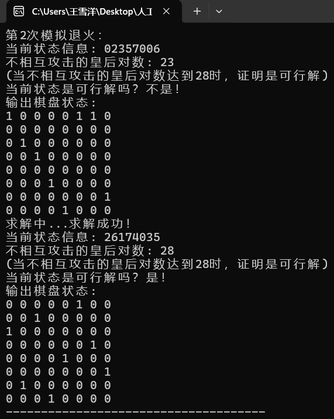

# <center>lab03-比特匠心&模拟退火（Bit Hacks） 
<center>学号：21130041034&emsp;&emsp;姓名：王雪洋</center>

## 1.正确的描述回溯法及其改进后算法的思路
### （1）回溯法
#### 思路:
&emsp;&emsp;用n元组x[1:n]表示n后问题的解。其中x[i]门表示皇后i放在棋盘的第i行的第r[i]列。由于不允许将2个皇后放在同一列，所以解向量中的x[i]门互不相同。2个皇后不能放在同一斜线上是问题的隐性约束，这个需要下面的特殊技巧。\
&emsp;&emsp;将nXn格棋盘看作二维方阵，其行号从上到下，列号从左到右依次编号为1，2.….n，从棋盘左上角到右下角的主对角线及其平行线(即斜率为-1的各斜线)上，2个下标值的差(行号一列号)值相等。同理，斜率为+1的每一条斜线上，2个下标值的和(行号+列号)值相等。因此,若2个皇后放置的位置分别是(i.i)和(kol),日i-i=k-1或i+j=k+1，则说明这2个皇后处于同一斜线上。以上2个方程分别等价于i-k=j-l和i-k=l一j。由此可知，只要|i-k|=lj-1成立，就表明2个皇后位于同一条斜线上。通过这个技巧，就能顺利处理同一斜线的冲突了。\
&emsp;&emsp;用回溯法解n后问题时，用完全n叉树表示解空间。可行性约束place剪去不满足行、列和斜线约束的子树。\
&emsp;&emsp;下面的解n后问题的回溯法中, 递归方法 backtrack(1)实现对整个解空间的回溯搜索。backtrack(i)搜索解空间中第i层子树。类Queen的数据成员记录解空间中结点信息,以减少传给 backtrack的参数。sum记录当前已找到的可行方案数。\
&emsp;&emsp;在backtrack()函数中，当i>n时，算法搜索至叶结点，得到一个新的n皇后互不攻击放置方案，当前已找到的可行方案数sum增1；当i<=n时，当前扩展结点Z是解空间中的内部结点。该结点有x[i]=1，2，…，n， 共n个儿子结点。对当前扩展结点Z的每一个儿子结点, 由place()函数检查其可行性, 并以深度优先的方式递归地对可行子树搜索，或剪去不可行子树。

#### C语言代码：
```C
int Check(int row, int col)
{
    for(int i = 1; i < row; i++)
    {
        if(col == x[i] || abs(row - i) ==abs(col - x[i])) 
        	//在同一列或者在同一斜线。一定不在同一行
            return 0;
    }
    return 1;
}

void backtrack(int k)
{
    if(k>n)     //求出一种解， sum+1
    {
        sum++;
        return;
    }
    for(int i=1; i<=n; i++)//n叉树
    {
        if(Check(k, i))     //剪枝，检查是否满足条件
        {
            x[k]=i;      //记录第k皇后在第i列
            backtrack(k+1);   //递归查找
        }
    }

}
```
#### 运行结果截图


### （2）位运算算法改进
#### 思路：
&emsp;&emsp;位运算算法是如今求解n皇后问题的最快算法。普通的回溯法速度太慢，而使用位运算能够加快程序运行速度，因此引进位运算改进算法。在这里使用二进制来表示一个集合，将集合的交并补运算直接使用位运算来实现。\
&emsp;&emsp;通过使用三个参数row、ld和rd，分别表示在纵列和两个对角线方向的限制条件下这一行的哪些地方不能放。位于该行上的不能放置的位置就用row、ld和rd中的1来表示。把它们三个并起来，得到该行所有的禁位，取反后就得到所有可以放的位置（用pos来表示）。\
&emsp;&emsp;需要注意的是，对应row、ld和rd来说1表示的是不能放置皇后的占用位置，但对于pos来说1代表可以放置皇后的位置。而且，我们要注意递归调用时三个参数的变化，每个参数都加上了一个占位，但两个对角线方向的占位对下一行的影响需要平移一位。最后，如果递归到某个时候发现row=upperlim了，说明n个皇后全放进去了，找到的解的个数加1。
#### C语言代码：                            
```C 
upperlim =  (1 << n)-1; Ans = 0;//初始化
void test(int row, int ld, int rd)  
{  
    int pos, p;  
    if ( row != upperlim )  
    {  
        pos = upperlim & (~(row | ld | rd ));  
        while ( pos )  
        {  
            p = pos & (~pos + 1);  
            pos = pos - p;  
            test(row | p, (ld | p) << 1, (rd | p) >> 1);  
        }  
    }  
    else  
        ++Ans;  
}
```
#### 运行结果截图


### （3）输出问题可行解
#### 思路：
&emsp;&emsp;初始化：创建一个N×N的棋盘，并初始化所有位置为空。\
&emsp;&emsp;递归放置皇后：从第一行开始，尝试在每一列放置一个皇后，并检查是否满足条件。\
&emsp;&emsp;检查条件：确保新放置的皇后不会与已放置的皇后在同一行、同一列或同一条对角线上。\
&emsp;&emsp;回溯：如果某个位置无法放置皇后，则回溯到上一步，尝试其他位置。\
&emsp;&emsp;记录解：当成功放置N个皇后时，记录当前的棋盘布局为一个解。

#### C语言代码：
```C 
void PutQueen(int x, int y, vector<vector<int> > &cant_put) {
    // 8个方向的偏移量
    int dot_x[8] = {-1, 0, 1, -1, 1, -1, 0, 1};
    int dot_y[8] = {-1, -1, -1, 0, 0, 1, 1, 1};

    // 标记当前位置不能放置皇后
    cant_put[x][y] = 1;

    // 标记皇后所在位置的所有攻击范围
    for (int i = 1; i < cant_put.size(); i++) {
        for (int j = 0; j < 8; j++) {
            int node_x = x + i * dot_x[j];
            int node_y = y + i * dot_y[j];
            if (node_x >= 0 && node_x < cant_put.size() && node_y >= 0 && node_y < cant_put.size()) {
                cant_put[node_x][node_y] = 1;
            }
        }
    }
}
```

#### 运行结果截图


## 2.正确的描述多项式时间算法的代码思想
#### 思路：
&emsp;&emsp;**N皇后问题**是一个NP-Hard问题，其求解算法复杂度是指数复杂度的，没有多项式时间算法解。\
&emsp;&emsp;什么是多项式时间算法呢？\
&emsp;&emsp;对于一个算法，如果它的时间复杂度可以表示为关于输入规模n的多项式：

&emsp;&emsp;&emsp;&emsp;**T(n) = O(n^k)**

&emsp;&emsp;其中，T(n)表示算法处理规模为n的输入所需的时间，O(n^k) 表示算法时间复杂度是n^k的量级，k是常数。\
&emsp;&emsp;那么这个算法就称为多项式时间算法。多项式时间算法能够用来区分P类问题与NP类问题，前者可以用多项式时间算法求解，后者只能用多项式时间算法验证解。典型的多项式时间算法包括：排序算法（快速排序和归并排序），图算法（迪杰斯特拉算法），矩阵乘法等等。

## 3.正确的描述模拟退火算法的思想
#### 思路：
&emsp;&emsp;**模拟退火算法**是人工智能中计算最优解的一个重要算法。对于八皇后问题而言，模拟退火算法随机抽取1个当前状态的后继状态，并用评估值函数的结果来判断这个后继状态的好坏。\
&emsp;&emsp;我选择使用**不相互攻击的皇后**的数量h_of_not_attack_pair()来计算后继状态的评估值。如果评估值更优，说明新状态比当前状态要好，那么模拟退火算法会接受这个新的状态；即使新状态比当前状态要差，模拟退火算法也是会以某个小于1的概率接受这个新的状态。\
&emsp;&emsp;退火函数计算出来的、能接受更差状态的概率，是模拟退火算法的关键。而且，随着时间推移，这个概率应该越来越小，否则模拟退火算法的结果是难以收敛到最优解的，所以退火函数的结果应该随时间递减。
#### C语言代码：                            
```C 
// 退火函数
float schedule(float T) {
    return 0.99 * T;
}

// 退火过程
bool Simulated_Annealing(Board* board, float(*p)(float)) {
    int steps = 0;
    double T = 5;        // 把初始温度设置为 5
    string old_state = board->get_state();
    string new_state = old_state;
    int old_value = 0;
    int new_value = 0;

    while (T > 0.00001) {
        ++steps;
        old_value = board->h_of_not_attack_pair();    // 使用不相互攻击的皇后的对数作为评价函数
        if (board->check(1)) {                        // 如果成功找到解
            SA_success_total_steps += steps;
            return true;
        }
        T = (*p)(T);                                // 降温

        // 随机选择一个新的邻接状态
        // 随机抽取一个列 y
        int y = rand() % 8;
        int x = 0;
        // 随机抽取该列中的 free 的行 x（也即没有皇后的行）
        while (1) {
            x = rand() % 8;
            if (x != old_state[y] - '0') break;
        }
        new_state = old_state;
        new_state[y] = x + '0';

        board->set_state(new_state);
        board->fill_in_board();
        new_value = board->h_of_not_attack_pair();    // 随机新状态的评估值
        int deltaE = (new_value - old_value);

        if (deltaE > 0) {                            // 如果新的评估值更优
            old_state = new_state;                    // 更新为新的状态
        }
        else {
            // 如果新的评估值差于旧的评估值，则有小概率采纳新的较差的评估值对应的新状态，允许下山
            if (((float)(rand() % 1000) / 1000) < exp(deltaE / T)) {
                old_state = new_state;
            }
            else {    // 较差的新状态被否决，时间越长，较差的新状态越容易被否决
                board->set_state(old_state);
                board->fill_in_board();
            }
        }
    }

    SA_failed_total_steps += steps;
    return false;
}
```
#### 运行结果截图


