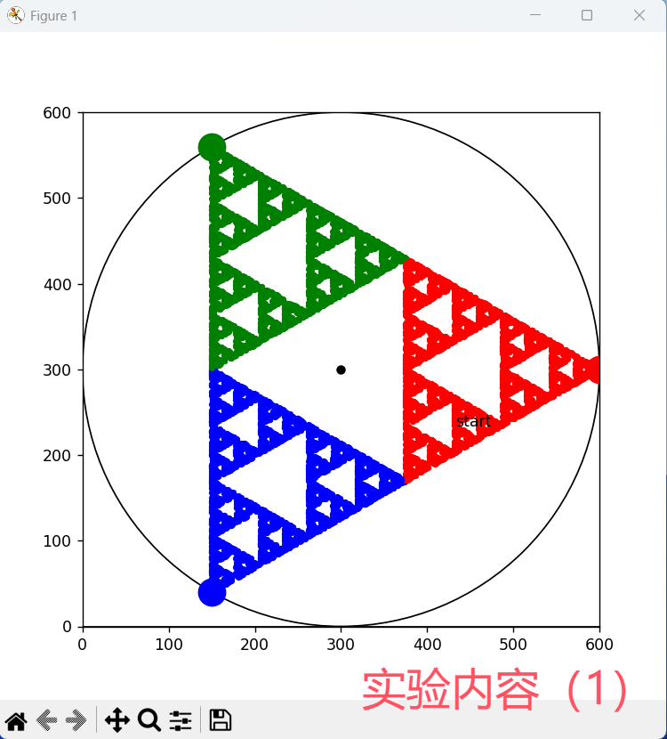
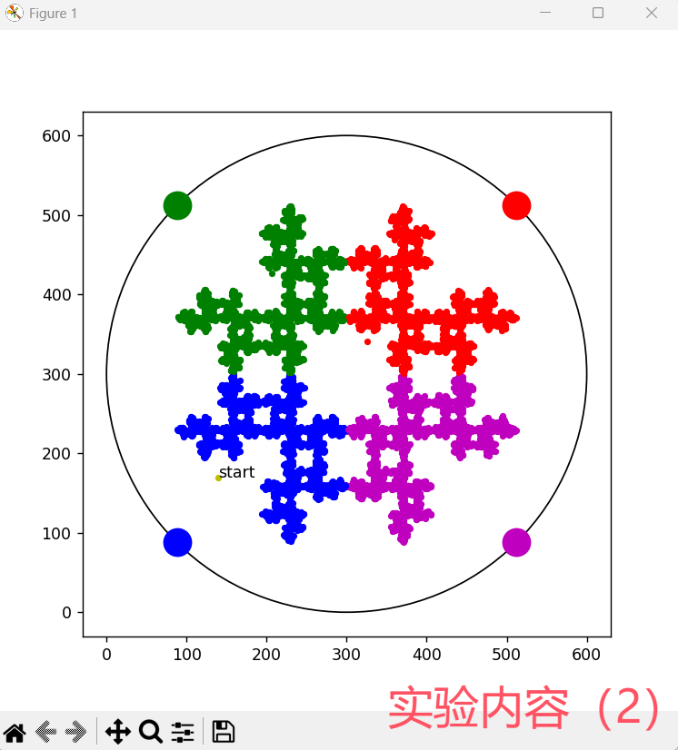
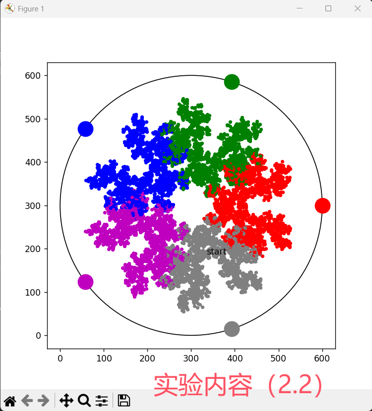
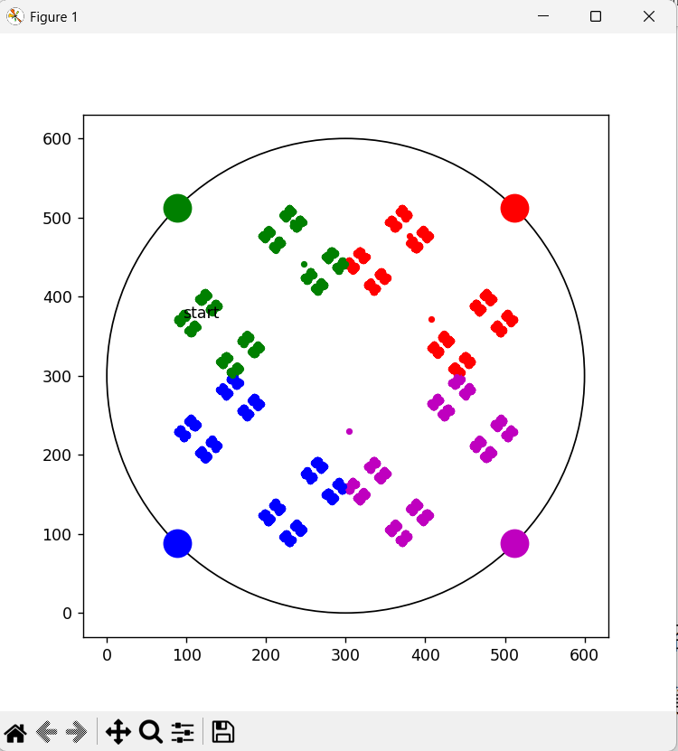
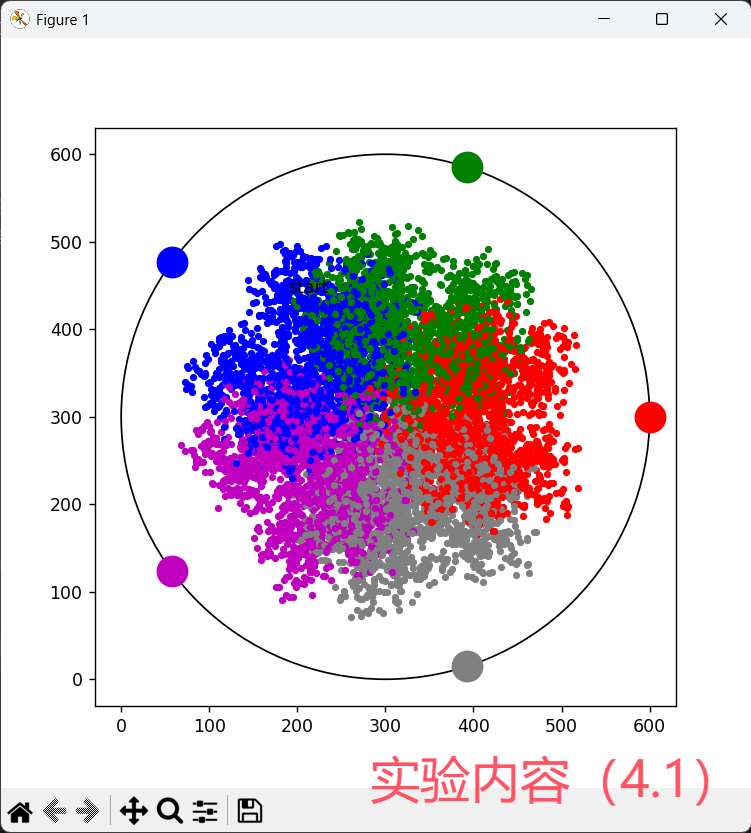
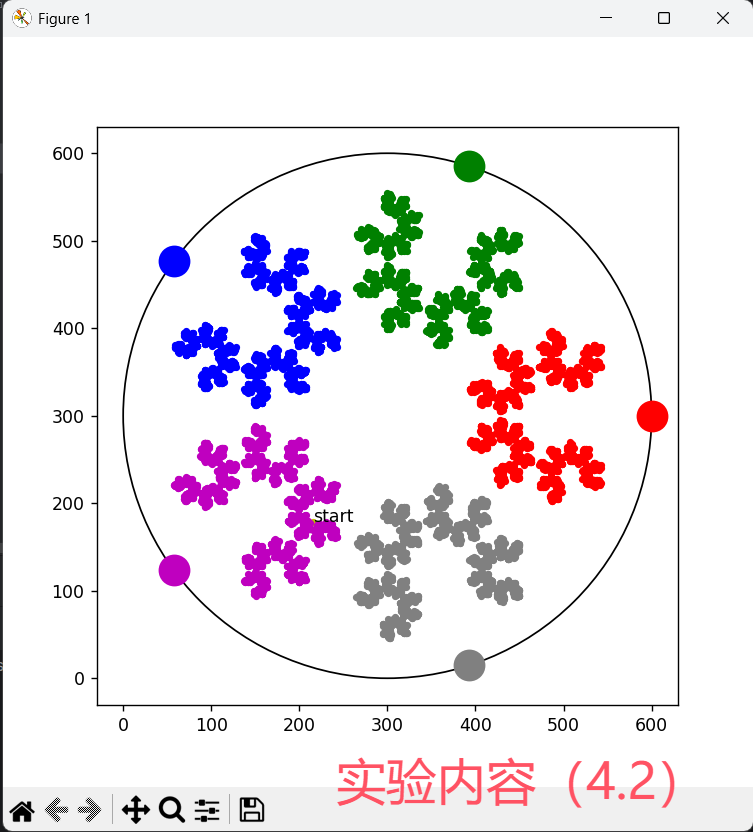
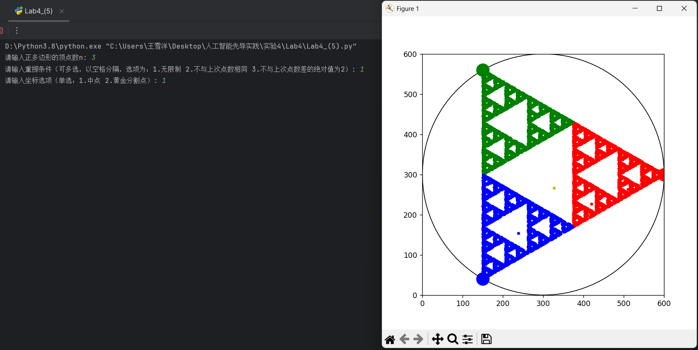
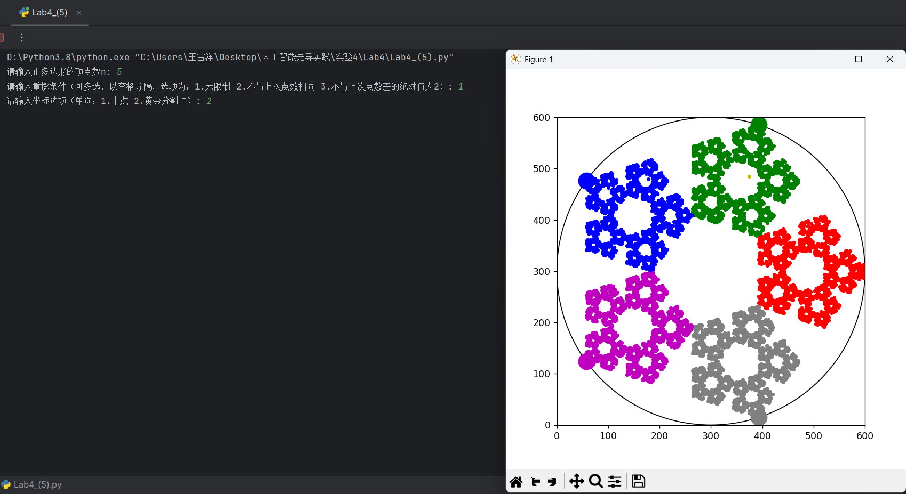

# <center>lab04-我是海边的一粒沙
<center>学号：21130041034&emsp;&emsp;姓名：王雪洋</center>

## 1.四个任务
### （1）当 n=3 时，靠向红绿蓝顶点的沙子，分别用与顶点相同的颜色画。
#### 思路:
&emsp;&emsp;在本次实验之前，我从未接触过画布，上网一搜，大家都说python的matplotlib库很方便好用，所以我就采用了这个库。通过学习这个库的基本操作，我成功地创建了画布并画出了所需圆；接下来要创建内接正三角形，这个有点数学难度，我参考了网上的方法，用“圆心坐标+半径x弧度”的方法来确定内接正三角形的顶点坐标，成功确定了三个顶点。\
&emsp;&emsp;接下来随机生成一个点，并通过“该点是否在三角形三条边的同一侧”的方法来判断这个点的坐标是否在内接三角形内部。如果在，则将这个点设置为初始黄点，标记为start，并记录下这个点的坐标；否则重新生成，再次判断。\
&emsp;&emsp;最后做1万次循环，每次循环掷骰子根据点数选顶点，与上一步记录的坐标取中点，放置同色点。到这里，这个任务就完成了。\
&emsp;&emsp;代码详见Lab_4(1).py。

#### python代码：
```python
# 重复10000次，模拟1万次放置沙粒
for i in range(10000):
    # 模拟掷骰子，1或4对应红色顶点连线中点，2或5对应绿色顶点连线中点，3或6对应蓝色顶点连线中点
    dice_result = random.randint(1, 6)
    # 确定这个新点的颜色
    if dice_result in [1, 4]:
        target_vertex_index = 0
        color = 'red'
    elif dice_result in [2, 5]:
        target_vertex_index = 1
        color = 'green'
    else:
        target_vertex_index = 2
        color = 'blue'

    # 计算连线中点坐标
    if i == 0: # 如果第一次循环，要用到start的黄点坐标
        mid_x = (random_x + triangle_vertices_x[target_vertex_index]) / 2
        mid_y = (random_y + triangle_vertices_y[target_vertex_index]) / 2
    else: # 如果不是第一次了，就用上次循环的结果的坐标
        mid_x = (mid_x + triangle_vertices_x[target_vertex_index]) / 2
        mid_y = (mid_y + triangle_vertices_y[target_vertex_index]) / 2

    # 绘制新的对应颜色的点
    ax.scatter(mid_x, mid_y, color=color, marker='o', s=10)

```
#### 运行结果截图


### （2）当 n=4 和 5 时，添加一个限制：如果掷出的点数又指向上一次被选中的贝壳（顶点），则重新掷。
#### 思路：
&emsp;&emsp;n=4时，内接正方形有4个顶点，分别设为红绿蓝紫。只需要把上一步的内接正三角形和掷骰子的代码改改，然后再补充一个判断“本次点数是否与上次相同”，就可以完成这个任务了。n=5同理。\
&emsp;&emsp;一开始我想不明白n=4的时候如何平分骰子，后来我想到，只关注点数1 ~ 4、其余点数重掷，不就行了？再后来实际编程的时候，我才跳出思维框架：直接生成1~4的随机数不就行了！\
&emsp;&emsp;感觉n=4和5时模拟10000次循环相较于n=3运行起来真的好慢；另外，似乎n=4和n=5应该放在同一个代码文件里，但我还是选择分别放在两个文件里，这样方便和之前的n=3的代码进行横向对比。通过对比，发现代码重复率确实很高，这就很有代码复用的必要了。\
&emsp;&emsp;n=4代码详见Lab_4(2.1).py，n=5代码详见Lab_4(2.2).py。

#### python代码：
```python
# 当 n=4 和 5 时，添加一个限制：如果掷出的点数又指向上一次被选中的贝壳（顶点），则重新掷。
#（1）n=4时
# 计算内接正方形的四个顶点坐标
half_side_length = 300 / np.sqrt(2)
vertices = np.array([
    [300 + half_side_length, 300 + half_side_length],  # 右上顶点
    [300 - half_side_length, 300 + half_side_length],  # 左上顶点
    [300 - half_side_length, 300 - half_side_length],  # 左下顶点
    [300 + half_side_length, 300 - half_side_length]  # 右下顶点
])

# 循环10000次
last_dice_result = None
point_count = 0
while point_count < 100:
    dice_result = random.randint(1, 4)
    if dice_result == last_dice_result:
        continue

    # 根据骰子结果计算新的点坐标
    new_point = (random_point + vertices[dice_result - 1]) / 2
    ax.scatter(new_point[0], new_point[1], c=colors[dice_result - 1], s=10)
    random_point = new_point
    last_dice_result = dice_result
    point_count += 1
----------------------------------------------------------------------
#（2）n=5时
# 计算圆内接正五边形的顶点坐标
radius = 300
angle_step = 2 * np.pi / 5
vertices = np.array([
    [300 + radius * np.cos(i * angle_step), 300 + radius * np.sin(i * angle_step)]
    for i in range(5)
])

# 循环10000次
last_dice_result = None
point_count = 0
while point_count < 10000:
    dice_result = random.randint(1, 5)
    if dice_result == last_dice_result:
        continue
    # 根据骰子结果计算新的点坐标
    new_point = (random_point + vertices[dice_result - 1]) / 2
    ax.scatter(new_point[0], new_point[1], c=colors[dice_result - 1], s=10)
    random_point = new_point
    last_dice_result = dice_result
    point_count += 1
```
#### 运行结果截图
n=4时：\
\
n=5时：\


### （3）当 n=4 时，如果掷出的点数所指向的贝壳与上一次被选中的贝壳的距离为 2（对角的贝壳），则重新掷。
#### 思路：
&emsp;&emsp;这一任务只比（2）的任务多一种重掷骰子的情况，那就是“骰子结果与上次骰子的结果之间的距离为2”，这个仅需要下面的简单的if判断即可实现。\
&emsp;&emsp;代码详见Lab_4(3).py。

#### python代码：
```python
    if point_count>0 and abs(dice_result - last_dice_result) == 2:
        continue
```

#### 运行结果截图


### （4）当 n=5 时，下一个位置在刚扔下的沙子和随机选中顶点的黄金分割处
#### 思路：
&emsp;&emsp;这一任务也很简单，就是把（2）的任务要求的“中点”改成了“黄金分割点”，其实换汤不换药，上网搜一下坐标转换公式，改写一下就能完成要求。\
&emsp;&emsp;代码详见Lab_4(4).py。

#### python代码：
```python
# 根据骰子结果计算新的点坐标(黄金分割点)
    new_point = vertices[dice_result - 1] + (random_point - vertices[dice_result - 1]) * golden_ratio
    #或者
    #new_point = random_point + (vertices[dice_result - 1] - random_point) * golden_ratio
```

#### 运行结果截图
两种黄金分割点的运行结果：\
\



## 2.“贝壳统一论”
#### 思路：
&emsp;&emsp;总体分析以上4个任务，能够总结出关键的参数，包括：顶点数n，重掷条件con（多选：无限制，不与上次点数相同或不与上次点数差的绝对值为2或二者皆有），沙子坐标loc（单选：中点，黄金分割点）。据此编程，根据参数个数多设几个if语句，使程序能够根据参数判断什么时候要用什么样的具体循环方式。这样一来，一个程序就能完成所有的任务了。\
&emsp;&emsp;3个参数，能够实现3x4x2=24种情况，但在此全部列举出来是不现实的，最后我选择展示了n=3、con=1、loc=1（即上一部分“四个任务”中的第1个任务）和n=5、con=1、loc=2（之前未实现过的搭配），这样可以大体上证明自己的程序可以完成所有的任务，达到了预期的要求。\
&emsp;&emsp;代码详见Lab_4(5).py。

#### python代码：
```python
# 获取用户输入部分
n = int(input("请输入正多边形的顶点数n: "))
reroll_conditions = input("请输入重掷条件（可多选，以空格分隔，选项为：1.无限制 2.不与上次点数相同 3.不与上次点数差的绝对值为2）: ").split()
coordinate_option = input("请输入坐标选项（单选：1.中点 2.黄金分割点）: ")

# 内接正n边形顶点相关操作部分
radius = 300
angle_step = 2 * np.pi / n
vertices = np.array([
    [300 + radius * np.cos(i * angle_step), 300 + radius * np.sin(i * angle_step)]
    for i in range(n)
])
color_list = ["r", "g", "b", "m", "gray"] * (n // 5 + 1)
color_list = color_list[:n]
for i in range(n):
    ax.scatter(vertices[i, 0], vertices[i, 1], c=color_list[i], s=300)

# 正n边形内部随机点生成部分
min_x, max_x = np.min(vertices[:, 0]), np.max(vertices[:, 0])
min_y, max_y = np.min(vertices[:, 1]), np.max(vertices[:, 1])
random_point = np.array([random.uniform(min_x, max_x),
                         random.uniform(min_y, max_y)])
ax.scatter(random_point[0], random_point[1], c='y', s=10)
```

#### 运行结果截图
既能够正确实现已有的要求n=3、con=1、loc=1：\
\
又可以快捷实现全新的要求n=5、con=2 3、loc=1：\
